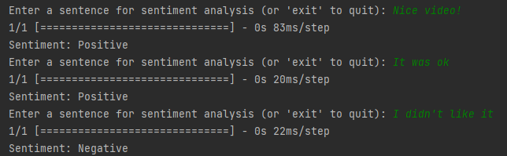
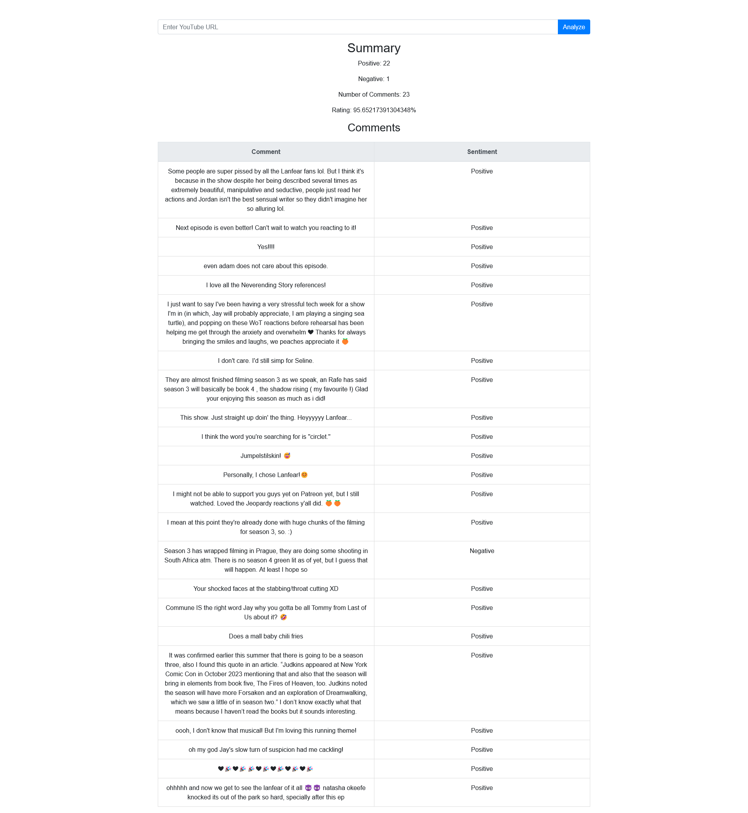

# Sentiment Recognition


## Description

Sentiment Recognition (AI + Python + Flask + Tensorflow + Pandas + Numpy). App creates, trains, and evaluates a sentiment analysis model using TensorFlow/Keras.
The model is designed to predict sentiment (negative, neutral, positive) based on text input.
App works in two mods.
1. Console application that let you check sentiment on any provided text.
This mode also allows to train model if it doesn't find it in folder of the app. 

2. Flask web application that integrates sentiment analysis functionality with YouTube comments
to provide sentiment predictions and a summary for a given YouTube video.


## Features

-     Load dataset
-     Train model
-     Save/load model
-     Let user in console mode input a custom text and get in return a prediction of the sentiment
-     Allows users to input a YouTube video URL for sentiment analysis.
-     Retrieves comments related to the video using the YouTube API.
-     Predicts sentiment (positive/negative) for each comment using a pre-trained sentiment analysis model.
-     Calculates and displays the count of positive and negative comments, the total number of comments, and the positivity rating.


## Screenshots

Main console for custom text sentiment recognition.




Flask app for sentiment recognition of comment section under Youtube video.




## Roadmap

- Add UI for custom text input instead of console
- Move part that load data away from case of just testing model in console


## Deployment and running

Clone the project

```bash
  git clone https://link-to-project
```

Go to the project directory

```bash
  cd SentimentRecognition
```

Setup and activate environment.

Install dependencies from requirements.txt
(it make take a while)

```bash
  pip install requirements.txt
```

Download and upload dataset to /data/ directory of the app:
[Data set](https://www.kaggle.com/datasets/kazanova/sentiment140?resource=download)

Create and set API Key to Google Youtube API in /app/.env

Start the app

Variant A - console prompt for custom text
```bash
  Run main.py script 
```

Variant B - web app for automatic validation of Youtube comments section
```bash
  Run app/server.py script 
```

## Usefull links

 - [Data set](https://www.kaggle.com/datasets/kazanova/sentiment140?resource=download)
